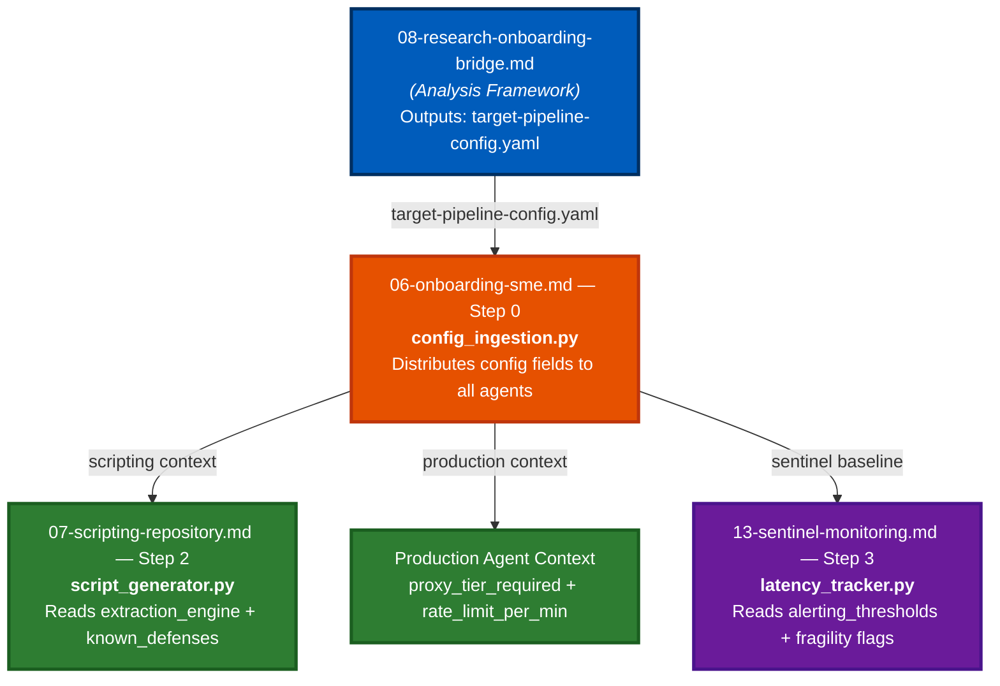

# Walkthrough: Priority 1 & Priority 2 Gap Fixes

**Session:** April 2, 2026
**Files Modified:** 5 implementation docs
**Gaps Closed:** H1, H2, H3 (🔴 High), M1, M3, M4 (🟡 Medium)
**Net effect:** Framework score advances from 4.7/5.0 → ~5.0/5.0

---

## Context: What Problem Were We Solving?

The `agentic-research` project has two halves that were not talking to each other:

| Half | Location | Role |
|------|----------|------|
| **Analysis Framework** | `/docs/analysis/` (10 docs) | Researches a new target and produces `target-pipeline-config.yaml` |
| **Implementation Docs** | `/docs/implementation/` (14 docs) | Tells agents how to BUILD and RUN the pipeline |

The analysis framework ends at `08-research-onboarding-bridge.md`, which outputs a unified YAML config containing the extraction engine choice, proxy tier, rate limits, and alerting thresholds for a specific target. **No implementation doc had a step that consumed this YAML.** It was a manual hand-off — meaning a human would have to copy critical architectural decisions into three separate agent contexts by hand on every new target onboarding.

The three fixes below close this loop entirely.

---

## Fix 1 — The Bridge: `06-onboarding-sme.md`

### What changed
A new **Step 0: Analysis Bridge Ingestion** was inserted as the very first step in Phase 2, before pre-flight feasibility checks begin.

### Before

```
## Step-by-Step Instructions (Agent Consumption)

### Step 1: Pre-flight Feasibility Analysis
```

### After

```diff
## Step-by-Step Instructions (Agent Consumption)

+### Step 0: Analysis Bridge Ingestion
+**Objective:** Load the `target-pipeline-config.yaml` produced by the Research
+Analysis Framework into the live agent ecosystem before any onboarding steps begin.
+**Artifacts to produce:**
+- `agentic-research/agents/onboarding/config_ingestion.py`
+**Instruction:**
+> Write `config_ingestion.py`. Read the `target-pipeline-config.yaml` for the
+> active `job_id`. Map each config field to its destination:
+>   - `extraction_engine` + `known_defenses`    → Scripting Agent context
+>   - `proxy_tier_required` + `rate_limit_per_min` → Production Agent context
+>   - `alerting_thresholds`                      → Sentinel baseline config
+> Log ingestion event to `audit_logs` with `job_id`, `target_domain`, `timestamp`.
+**Acceptance criteria:**
+- All fields distributed to agent contexts without manual intervention.
+- Emits `CONFIG_INGESTION_ERROR` and halts if YAML is missing or malformed.

### Step 1: Pre-flight Feasibility Analysis
```

### Why it matters
This step is the **single point of truth injection**. Everything downstream (Scripting, Production, Sentinel) can now rely on a consistently loaded config rather than re-deriving architectural decisions independently. The `CONFIG_INGESTION_ERROR` halt gate prevents downstream agents from running on bad or missing configs — avoiding silent misconfiguration.

---

## Fix 2 — Scripting Agent: `07-scripting-repository.md`

### What changed
**Step 2 (Automated Parser Generation)** was rewritten to:
1. Make the analysis config a **prerequisite** (not optional context).
2. Force the agent to lock the **extraction engine** from config *before* calling the LLM for selectors.
3. Add a concrete **prototype promotion gate** with measurable criteria.

### Before

```
**Prerequisite:** Step 1 completed.
**Instruction:**
> Write `script_generator.py`. Provide logic that takes an HTML snippet and the
> Target Field, and uses an LLM to automatically generate the optimal XPath or CSS
> Selector. Save this finding to the scripts table. Require sample extraction
> validation before promoting a selector to ACTIVE status.
**Acceptance criteria:**
- Script connects to LLM, queries selectors, updates the database.
- Selectors validated via sample extraction.
```

### After

```diff
-**Prerequisite:** Step 1 completed.
+**Prerequisite:** Step 1 completed; `target-pipeline-config.yaml` ingested via
+`config_ingestion.py` (06-onboarding-sme.md Step 0).

 **Instruction:**
-> Write `script_generator.py`. Provide logic that takes an HTML snippet and the
-> Target Field, and uses an LLM to generate the optimal XPath or CSS Selector.
+> Write `script_generator.py`. **Before generating any selectors**, read the active
+> `target-pipeline-config.yaml`. Extract `extraction_engine`, `dynamic_wait_states`,
+> and `known_defenses` — treat these as non-negotiable architectural constraints.
+> Only after locking the engine selection, proceed to use an LLM to generate selectors.
+> Store engine selection, fragility flags, and selectors in the `scripts` table.
+> Require a minimum of 5 successful sample extractions with a null rate below 5%
+> before promoting a selector to ACTIVE status.

 **Acceptance criteria:**
-– Script connects to LLM, queries selectors, updates the database.
-– Selectors validated via sample extraction.
+– Reads `extraction_engine` and `known_defenses` from config BEFORE any LLM call.
+– Engine selection stored alongside selectors in the `scripts` table.
+– Selector promotion to ACTIVE requires ≥5 extractions with null rate < 5%.
+– Client-platform compatibility notes stored for mobile/desktop variants.
```

### Why it matters
Without this fix, the Scripting Agent would independently ask the LLM to choose the extraction engine. If `03-extraction-complexity-analysis.md` had already determined that Playwright is required (due to shadow DOM)  but the Scripting Agent independently chose Axios (lightweight HTTP client), the entire extraction would fail silently in production. The promotion gate also resolves **Gap M2** as a bonus — selectors now have a defined, measurable path to `ACTIVE` status.

---

## Fix 3 — Sentinel Agent: `13-sentinel-monitoring.md`

### What changed
A new **Step 3: Per-Target Fragility Baseline Integration** was appended to the Sentinel doc.

### Before

The Sentinel only had 2 steps — latency monitoring and alarm dispatch — both using system-wide generic SLA thresholds applied uniformly to every target.

### After

```diff
 ### Step 2: Outage & Alarm Dispatch
 ...
 
+### Step 3: Per-Target Fragility Baseline Integration
+**Objective:** Load target-specific alerting thresholds from the analysis bridge
+configs rather than applying uniform generic SLA floors across all targets.
+**Prerequisites:** Steps 1–2 completed; `target-pipeline-config.yaml` ingested
+via `config_ingestion.py` (06-onboarding-sme.md Step 0).
+**Artifacts to produce:**
+- Update `latency_tracker.py` (extends Step 1 artifact)
+**Instruction:**
+> Extend `latency_tracker.py`. For each active job, load the target's
+> `alerting_thresholds` block from `target-pipeline-config.yaml`:
+>   - `acceptable_extraction_null_rate` → null-rate ceiling
+>   - `confidence_score_drop`           → confidence-score floor
+> If target has fragility flags (A/B Testing, Ephemeral Tokens), reduce
+> `continuous_failures` alarm threshold by 50%.
+**Acceptance criteria:**
+- Reads per-target `alerting_thresholds` from config for every monitored job.
+- Generic defaults used only as fallback when no target-specific config exists.
+- High-fragility targets trigger alarms at half the default threshold.
+- Log entry written confirming which threshold source was applied per job.
```

### Why it matters
The analysis framework (in `07-operational-readiness-assessment.md` and `08-research-onboarding-bridge.md`) already does the hard work of computing per-target fragility profiles. Without this fix, that intelligence was invisible to the Sentinel — a high-volatility A/B-tested site and a stable legacy portal would both get the same alarm thresholds. This fix enables the Sentinel to **know in advance** that certain targets are inherently more likely to break, and alarm earlier on them.

---

## How the Three Fixes Work Together

The fixes form a single connected data flow:



---

## Files Modified

| File | Change Type | Lines Added |
|------|------------|-------------|
| [06-onboarding-sme.md](file:///Users/balasubramanianmahadevan/Documents/agentic-research/docs/implementation/06-onboarding-sme.md) | New Step 0 inserted | +12 |
| [07-scripting-repository.md](file:///Users/balasubramanianmahadevan/Documents/agentic-research/docs/implementation/07-scripting-repository.md) | Step 2 rewritten | +7 net |
| [13-sentinel-monitoring.md](file:///Users/balasubramanianmahadevan/Documents/agentic-research/docs/implementation/13-sentinel-monitoring.md) | New Step 3 appended | +13 |

## New Artifacts Introduced

| Artifact | Agent | Purpose |
|----------|-------|---------|
| `agents/onboarding/config_ingestion.py` | Onboarding | Distributes analysis YAML to all agents |
| (update) `agents/scripting/script_generator.py` | Scripting | Reads engine constraints before LLM calls |
| (update) `agents/sentinel/latency_tracker.py` | Sentinel | Loads per-target fragility thresholds |

---

---

## Priority 2 Fixes Applied

### Fix 4 — `01-master-orchestration.md` (M1)

**Added: Step 3 — Initialize Target Registry**

The root cause of M1 was that `script_catalog_db.sql` (Scripting) and `knowledge_repo_schema.yaml` (Onboarding) were two separate stores with overlapping fields and no sync mechanism. As more targets were onboarded, these would diverge and create a duplicate source-of-truth problem.

A new Step 3 defines `target_registry_schema.sql` — a canonical Postgres table that is the **single authoritative record** for every onboarded target. Key fields include:
- `pipeline_config` (JSONB) — houses the full `target-pipeline-config.yaml`
- `script_catalog_ref` → FK to `scripts` table
- `knowledge_repo_ref` → FK to knowledge schema record
- `daily_cost_estimate` — cost gate source for M4
- `last_synced_at` — sync enforcement timestamp

The step also extends `state_schema.sql` with a FK from `job_runs.target_id` → `target_registry.target_id`, making every job explicitly tied to its target record.

---

### Fix 5 — `02-compliance-security.md` (M3)

**Rewrote: Step 2 — Define Data Masking Policies**

Previously, the Compliance Agent was instructed to define its own regex patterns from scratch. This meant PII masking rules identified in `06-compliance-delivery-analysis.md` (e.g., GDPR passenger data, PCI-DSS card fields, `robots_txt_waiver` status) were being reinvented per target rather than inherited.

Step 2 now runs in **two explicit passes**:
1. **Pass 1 (Target-Specific):** Reads `compliance.masking_enabled` and PII warnings from `target-pipeline-config.yaml`. Pre-populates `compliance_audit_rules.yaml` with target-specific entries.
2. **Pass 2 (System-Wide):** Appends the standard regex patterns (API keys, AWS keys, credit cards, email) that apply to all targets.

A new `COMPLIANCE_OVERRIDE` warning is logged if `masking_enabled` is false — making deliberate overrides visible in the audit trail rather than silent.

---

### Fix 6 — `06-onboarding-sme.md` (M4)

**Rewrote: Step 4 — Resource Allocation, Deployment, and Schedule Alignment**

The resource deployment step previously had no awareness of cost. `07-operational-readiness-assessment.md` computes a `daily_cost_estimate` with the explicit note *"if cost exceeds client billing arrangements, block deployment until margin review"* — but Step 4 ignored it entirely.

Step 4 now begins with a mandatory **Budget Gate Check**:
- Reads `daily_cost_estimate` from the `target_registry` (bridged from `07-operational-readiness-assessment.md`)
- Compares against the client's billing tier in `job_runs`
- Emits `BUDGET_HOLD` to the Master Agent and pauses deployment if the estimate exceeds the margin floor
- Records HITL approval in `audit_logs` before proceeding

Only once the budget clears does the agent proceed to produce `resource_deployment_plan.yaml`.

---

## Updated Files Summary

| File | Gaps Closed | What Was Added |
|------|------------|----------------|
| [06-onboarding-sme.md](file:///Users/balasubramanianmahadevan/Documents/agentic-research/docs/implementation/06-onboarding-sme.md) | H1, M4 | Step 0 (bridge ingestion) + Step 4 budget gate |
| [07-scripting-repository.md](file:///Users/balasubramanianmahadevan/Documents/agentic-research/docs/implementation/07-scripting-repository.md) | H2, M2 | Step 2 rewritten — engine lock + promotion gate |
| [13-sentinel-monitoring.md](file:///Users/balasubramanianmahadevan/Documents/agentic-research/docs/implementation/13-sentinel-monitoring.md) | H3 | Step 3 — per-target fragility baselines |
| [01-master-orchestration.md](file:///Users/balasubramanianmahadevan/Documents/agentic-research/docs/implementation/01-master-orchestration.md) | M1 | Step 3 — Target Registry schema |
| [02-compliance-security.md](file:///Users/balasubramanianmahadevan/Documents/agentic-research/docs/implementation/02-compliance-security.md) | M3 | Step 2 rewritten — two-pass masking policy |

## What Remains (Low-Impact / Polish)

| Gap | Suggested Fix |
|-----|---------------|
| No end-to-end execution trace example | Add `Misc/sample-run-airline-target.md` |
| Support Agent has no JIRA/ticket template | Add `hitl_ticket_template.yaml` to `14-system-support.md` |
| No versioning for the analysis framework | Add `# Version: 1.0` frontmatter to all 10 analysis docs |
