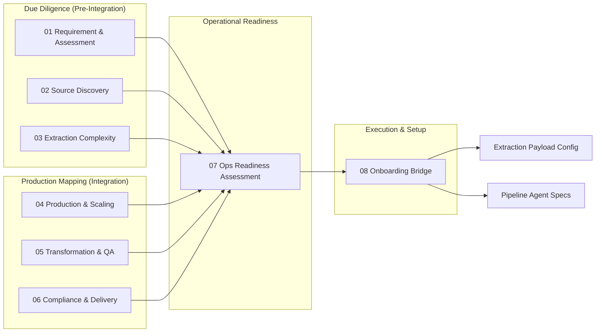

# Agentic Research Data Target Analysis Framework

> **Purpose:** A structured, repeatable framework for deep-diving into a new data extraction target (e.g., travel providers, OTAs, public registries) before and during the instantiation of a production agentic pipeline.

---

## Why This Exists

The Agentic Research pipeline depends on **robust schemas, predictable scale, and proactive evasion/compliance mapping** to ensure 99.9% uptime. This framework ensures we:

1. **Assess** the target's feasibility, extraction complexity, and compliance risk before committing scripting resources.
2. **Extract** the exact source map, DOM structures, API limits, and expected schema overlaps needed to go live.
3. **Seed** agent configurations, scaling proxies, and validation rules with verified mapping data — not placeholders.

> [!IMPORTANT]
> Every metric collected here maps directly to an agent role, a scaling definition, or a compliance guardrail in the system. If we can't measure the complexity, we can't automate the extraction.

---

## Framework Structure

| # | Document | What It Covers | Primary Identifying Phase |
|---|---|---|---|
| 01 | [Requirement & Assessment](01-requirement-assessment-analysis.md) | Client intent clarity, scheduling constraints, requirement validation | P1: Assessment |
| 02 | [Source Discovery](02-source-discovery-analysis.md) | Deep-link mapping, evasion checks, sub-source feasibility | P2: Discovery & SME |
| 03 | [Extraction Complexity](03-extraction-complexity-analysis.md) | DOM analysis, SPA/PDF routing, required scraping scripts | P2: Scripting & P3: Extraction |
| 04 | [Production & Scaling](04-production-scaling-analysis.md) | Proxy requirements, expected volumes, rate-limit thresholds | P3: Production & Scaling |
| 05 | [Transformation & QA](05-transformation-qa-analysis.md) | Client schema gaps, validation rules, confidence baselines | P4: Transformation & Validation |
| 06 | [Compliance & Delivery](06-compliance-delivery-analysis.md) | Credential security, PII exposure risks, SLA targets | P0: Compliance & P5: Delivery |
| 07 | [Operational Readiness](07-operational-readiness-assessment.md) | End-to-end readiness scoring, HITL requirements | Synthesis |
| 08 | [Research Onboarding Bridge](08-research-onboarding-bridge.md) | Mapping analysis findings to actual agent configs and YAMLs | Bridge |
| 09 | [Autonomous Execution Playbook](09-autonomous-research-execution-playbook.md) | How the AI agents run this entire analysis end-to-end | Orchestration |

---

## Analysis Phases

### Phase 1: Pre-Integration Diligence (Discovery Phase)

**Goal:** Determine if the data target can be safely, legally, and reliably extracted at the client's requested scale.

**Data sources evaluated:**
- Target root domain and robots.txt
- Publicly available API endpoints
- Client-provided seed URLs and authentication credentials
- Initial evasion/bot-protection signatures (Cloudflare, heavily obfuscated SPA)

**Output:** Go/no-go recommendation for deeper scripting and development.

### Phase 2: Post-Integration Mapping (Scripting Phase)

**Goal:** Establish the definitive baseline for extraction logic, scaling proxies, and QA transformation mapping.

**Additional contexts unlocked:**
- Authenticated state DOM profiles
- Hidden network payloads (XHR/Fetch inspection)
- Edge-case pagination traces
- Rate-limit thresholds (measured experimentally)

**Output:** Fully populated Extraction Tool mappings, Validation rules, and scaling proxy assignments.

### Phase 3: Continuous Data Production

**Goal:** Agents consume the mappings and begin the continuous data capture cycle.

**Handoff:** This is where the initial readiness framework transitions to the ongoing Orchestrator supervision and Sentinel alerting.

---

## Scoring & Readiness Model

Each analysis document produces a **domain readiness score** (1–5) reflecting extraction viability:

| Score | Label | Meaning |
|---|---|---|
| 1 | 🔴 Critical | Hard blockers. Target unreachable, structurally hostile, or legally restricted. |
| 2 | 🟠 Weak | Intermittent availability. Heavy HITL required or extreme anti-bot evasion. |
| 3 | 🟡 Adequate | Slower scale. Operable but requires tight rate-limits and proxy rotations. |
| 4 | 🟢 Strong | Good DOM/API access. Standard scaling parameters and extraction tools apply. |
| 5 | 🔵 Excellent | Native API or highly structured, low-defense endpoints explicitly available for scraping. |

The [Research Onboarding Bridge (08)](08-research-onboarding-bridge.md) aggregates these into an **overall data source readiness score**.

---

## Related Documents

- [00-master-plan.md](../implementation/00-master-plan.md) — The core workflow phasing and implementation plan for the Agents.
