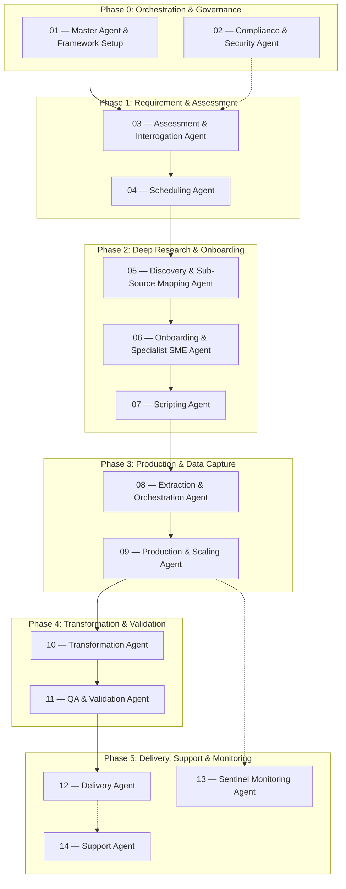

# Agentic Data Production — Infrastructure Implementation Master Plan

> **Purpose:** This is the top-level coordination document for building the agentic data production workflow. It merges the deep research capabilities evaluated in the project skills (Interrogation, Discovery, Orchestration, Validation) with the end-to-end operational workflow defined in the Travel Production Process Framework. Each phase is a separate document with dual-format instructions (human-review technical spec + LLM-agent-ready prompts).

---

## Architecture Decisions (Locked)

| Decision | Choice | Rationale |
|---|---|---|
| Core Orchestration | Master Agent | Centralized control system ensuring the agent ecosystem is scalable, reliable, and sequenced efficiently. |
| Requirement & Intent | Assessment & Interrogation | **Multimodal Ingestion:** Derives intent via Shop Manager, API, email/manual, chat, or requirement docs, generates request IDs, validates required inputs, and produces standardized briefs. |
| Deep Research & Feasibility | Discovery & Onboarding | **Conditional Fast-Tracking:** First checks the pre-built script/evasion library; maps unknown sources via specialist deep linking only when existing tools don't suffice, while preserving onboarding knowledge, resource planning, and schedule alignment. |
| Data Capture Engine | Scripting, Extraction & Production | Reusable script library combined with dynamic cloud scaling, output staging, proxy health management, billing/call logging, and retry logic for robust payload capture. |
| Validation & Quality | QA & Validation Agents | Cross-references data, performs schema checks, assigns trust/confidence scores, flags logic or range conflicts. |
| Output Standardization | Transformation & Delivery | Formats raw extracts to customized client schemas (CSV/JSON/API/DB) and manages secure delivery push with integrity checks and escalation paths. |
| Continuous Operations | Sentinel, Support, Compliance | Monitors system SLA latency, queue allocation, delivery summaries, billing signals, support case handling, and data exposure/security laws. |

---

## Phase Map



---

## Dependency Rules

1. **Phase 0 (Governance)** must exist first. The Master Agent orchestrates the sequence, and the Compliance Agent rules must validate system access globally.
2. **Phase 1 (Assessment)** is the entry point. It requires client inputs to generate the `research_brief` (via Interrogation), assign request tracking metadata, validate dependencies, and schedule the jobs.
3. **Phase 2 (Onboarding)** relies on the brief to discover deep-linked sources, perform feasibility checks, maintain source/client knowledge, align test and production resources, handle edge cases via SME, and develop extraction scripts.
4. **Phase 3 (Production)** depends on Phase 2 scripts. It handles infrastructure scaling, IP proxies, output staging, billing/call tracking, and executes data capture (via Orchestration tooling).
5. **Phase 4 (Validation)** requires the raw payload from Phase 3 to map to client schemas (Transformation), format, and audit against quality standards (QA).
6. **Phase 5 (Delivery)** pushes the validated structured data with delivery-integrity checks, escalation workflows, and operational summaries. The Sentinel Agent continuously monitors the Extraction nodes in parallel to prevent queue bottlenecks.

---

## Document Index

| # | Document | Phase | Dependencies | Focus / Assigned Agent |
|---|---|---|---|---|
| 01 | [01-master-orchestration.md](01-master-orchestration.md) | 0 | — | Master Agent: Control Center, Pipeline Design |
| 02 | [02-compliance-security.md](02-compliance-security.md) | 0 | 01 | Compliance Agent: Credentials, Audit, Risk, Awareness |
| 03 | [03-assessment-interrogation.md](03-assessment-interrogation.md) | 1 | 01 | Assessment/Interrogation Agent: Multimodal Ingestion, Request Tracking, Intent Parsing |
| 04 | [04-scheduling-triggering.md](04-scheduling-triggering.md) | 1 | 03 | Scheduling Agent: Queueing, Input Preparation, SLA Constraints |
| 05 | [05-source-discovery.md](05-source-discovery.md) | 2 | 03 | Discovery Agent: Fast-tracking, Deep Links |
| 06 | [06-onboarding-sme.md](06-onboarding-sme.md) | 2 | 05 | Onboarding/SME Agent: Feasibility, Knowledge Repo, Resource Planning, Evasion Configs |
| 07 | [07-scripting-repository.md](07-scripting-repository.md) | 2 | 06 | Scripting Agent: Script Development, Validation, Repo Mgmt |
| 08 | [08-extraction-orchestration.md](08-extraction-orchestration.md) | 3 | 07 | Extraction Agent: Tool Selection (SPA/PDF), Output Staging, Run Logic |
| 09 | [09-production-scaling.md](09-production-scaling.md) | 3 | 08 | Production Agent: Dynamic Scale, Proxy Rotation, Billing Signals |
| 10 | [10-transformation-mapping.md](10-transformation-mapping.md) | 4 | 09 | Transformation Agent: Schema Formatting (CSV/JSON) |
| 11 | [11-qa-validation.md](11-qa-validation.md) | 4 | 10 | QA/Validation Agent: Confidence Scores, Triangulation |
| 12 | [12-delivery-pipelines.md](12-delivery-pipelines.md) | 5 | 11 | Delivery Agent: SFTP/API/DB Push, Export Management, Integrity Checks |
| 13 | [13-sentinel-monitoring.md](13-sentinel-monitoring.md) | 5 | 09 | Sentinel Agent: Failure Detection, Queue Health, Run Tracking |
| 14 | [14-system-support.md](14-system-support.md) | 5 | 12 | Support Agent: Internal/External Helpdesk, Comms, Case Tracking |

---

## Document Format Convention

Every phase document strictly adheres to this structure:

```markdown
# Phase Title

## Overview (Human Review)
- What this phase accomplishes
- Key design decisions and trade-offs
- Prerequisites and outputs

## Step-by-Step Instructions (Agent Consumption)

### Step N: [Action Title]
**Objective:** What this step produces
**Prerequisites:** What must exist before this step
**Artifacts to produce:**
- Exact files/resources to create
**Instruction:**
> [Prompt-ready instruction for LLM agent]
**Acceptance criteria:**
- How to verify the step is complete
```
